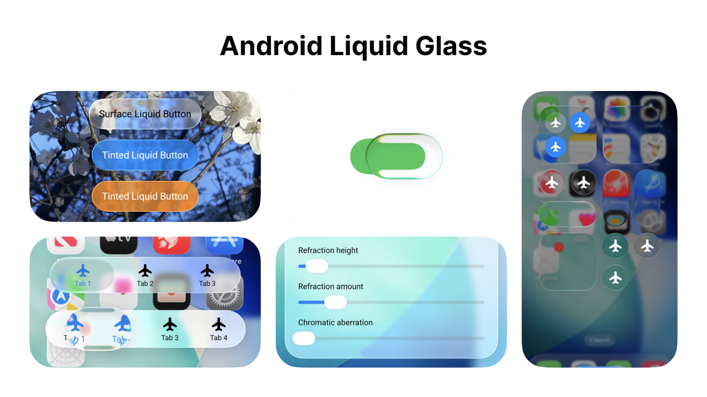

# Android Liquid Glass (Backdrop)

## Local Vormex Backend

Debug builds connect to the local `vormex-backend` by default:

- API: `http://127.0.0.1:5000/api`
- Socket.IO: `http://127.0.0.1:5000`

This is set up for both emulators and physical devices when you use `adb reverse tcp:5000 tcp:5000`, which makes the phone's `127.0.0.1:5000` point to your computer's local backend.

Quick start for a connected Android phone:

```bash
cd ../vormex-backend
npm run dev
```

In another terminal:

```bash
cd ../vormex-android
./scripts/connect-device.sh
```

If you prefer the emulator host bridge instead, override the debug URLs to `http://10.0.2.2:5000`.

You can override debug URLs with Gradle properties:

```properties
VORMEX_DEBUG_API_BASE_URL=http://10.0.2.2:5000/api
VORMEX_DEBUG_SOCKET_BASE_URL=http://10.0.2.2:5000
```



A customizable Liquid Glass effect library for Jetpack Compose.

## Docs

[](https://central.sonatype.com/artifact/io.github.kyant0/backdrop)

[Documentation](https://kyant.gitbook.io/backdrop)

## Components

The library does not include any high-level components; you will need to create your own.
Below are some example components:

- [LiquidButton](/catalog/src/main/java/com/kyant/backdrop/catalog/components/LiquidButton.kt)
- [LiquidToggle](/catalog/src/main/java/com/kyant/backdrop/catalog/components/LiquidToggle.kt)
- [LiquidSlider](/catalog/src/main/java/com/kyant/backdrop/catalog/components/LiquidSlider.kt)
- [LiquidBottomTabs](/catalog/src/main/java/com/kyant/backdrop/catalog/components/LiquidBottomTabs.kt)

## Demos

- [Backdrop Catalog](./catalog/release/catalog-release.apk)


- **(Deprecated)** [Liquid Glass Playground](./app/release/app-release.apk) (Android 13+)


